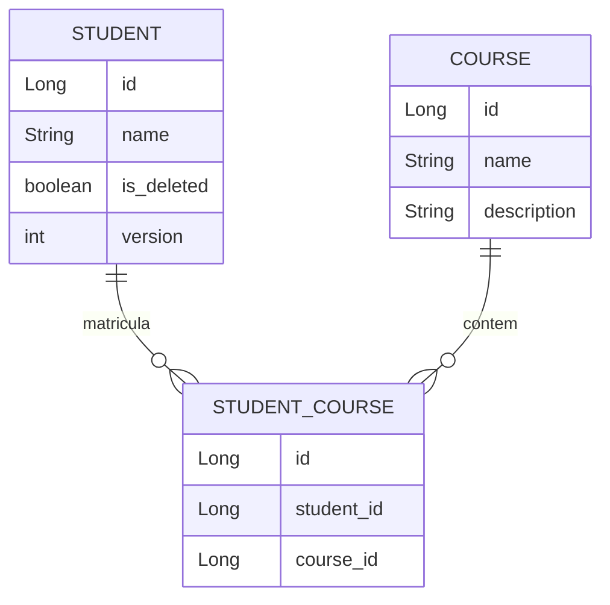

## Estratégias para Tratamento de Deleção envolvendo Associações

Entender como gerenciar a deleção de registros em um banco de dados relacional, especialmente quando há múltiplas
relações entre tabelas, é crucial para manter a integridade dos dados. Aqui estão algumas abordagens e boas práticas
para tratar essas situações.

### Tratamento de Deleção em Associações

1. **Cascade Delete (Deleção em Cascata)**
    - **Definição**: Permite que a deleção de um registro em uma tabela resulte automaticamente na deleção dos registros
      relacionados em outras tabelas.
    - **Uso**: Configurado em entidades JPA com a anotação `@OneToMany`, `@ManyToOne`, `@OneToOne`, ou `@ManyToMany` com
      a propriedade `cascade = CascadeType.REMOVE`.
    - **Cuidados**: Pode ser perigoso se não for usado corretamente, pois pode resultar na deleção de muitos registros
      relacionados inesperadamente.

   **Exemplo**:
   ```java
   @Entity
   public class Student {
       @Id
       private Long id;
       private String name;
   
       @OneToMany(mappedBy = "student", cascade = CascadeType.REMOVE)
       private List<Course> courses;
   }
   ```

2. **Restrict Delete (Restrição de Deleção)**
    - **Definição**: Impede a deleção de um registro se houver registros relacionados em outras tabelas.
    - **Uso**: Configurado no banco de dados com restrições de chave estrangeira (`FOREIGN KEY`) com a
      opção `ON DELETE RESTRICT`.
    - **Cuidados**: Assegura que não ocorra deleção de registros essenciais, mas requer tratamento de exceções na
      aplicação.

   **Exemplo SQL**:
   ```sql
   ALTER TABLE Course
   ADD CONSTRAINT fk_student
   FOREIGN KEY (student_id)
   REFERENCES Student(id)
   ON DELETE RESTRICT;
   ```

### Estratégias para Deleção Lógica

Quando a deleção física (remoção do registro da tabela) não é desejável devido a múltiplas relações ou necessidades de
auditoria/histórico, a deleção lógica é uma boa prática.

1. **Deleção Lógica com Campo de Status**
    - **Definição**: Em vez de deletar fisicamente o registro, um campo na tabela indica se o registro está ativo ou
      deletado.
    - **Uso**: Adiciona-se um campo como `isDeleted` ou `status` na entidade e filtra os registros baseados nesse campo.
    - **Cuidados**: Todas as consultas devem ser ajustadas para considerar o campo de deleção lógica.

   **Exemplo**:
   ```java
   @Entity
   public class Student {
       @Id
       private Long id;
       private String name;
       private boolean isDeleted; // Campo de deleção lógica
   }
   
   // Método para deletar logicamente um estudante
   public void deleteStudent(EntityManager entityManager, Long studentId) {
       Student student = entityManager.find(Student.class, studentId);
       if (student != null) {
           student.setDeleted(true);
           entityManager.merge(student);
       }
   }
   ```

2. **Estratégia de Versão (Soft Delete com Versões)**
    - **Definição**: Mantém o registro no banco de dados, mas cria uma nova versão quando há alterações ou deleções.
    - **Uso**: Usado em tabelas com um campo de versão e um campo de deleção lógica.
    - **Cuidados**: Pode aumentar a complexidade da consulta, mas é útil para auditoria e histórico de mudanças.

   **Exemplo**:
   ```java
   @Entity
   public class Student {
       @Id
       private Long id;
       private String name;
       private boolean isDeleted;
       private int version; // Campo de versão
   }
   
   // Método para deletar logicamente um estudante e incrementar a versão
   public void deleteStudent(EntityManager entityManager, Long studentId) {
       Student student = entityManager.find(Student.class, studentId);
       if (student != null) {
           student.setDeleted(true);
           student.setVersion(student.getVersion() + 1);
           entityManager.merge(student);
       }
   }
   ```

### Conclusão

A escolha entre deleção física e lógica depende do contexto da aplicação e dos requisitos específicos. Entender as
implicações de cada abordagem e aplicar as boas práticas adequadas ajuda a manter a integridade e a consistência dos
dados em sistemas complexos com múltiplas relações.
Criando um exemplo de aplicação Spring Boot que utiliza deleção lógica e controle de versão. A aplicação terá uma
entidade `Student` com campos de deleção lógica (`isDeleted`) e versão (`version`).

## Exemplo com o Spring boot Gerado por AI

### 1. Dependências no `pom.xml`

Primeiro, adicione as dependências necessárias no seu `pom.xml`:

```xml

<dependencies>
    <!-- Spring Boot Starter Data JPA -->
    <dependency>
        <groupId>org.springframework.boot</groupId>
        <artifactId>spring-boot-starter-data-jpa</artifactId>
    </dependency>

    <!-- H2 Database for simplicity -->
    <dependency>
        <groupId>com.h2database</groupId>
        <artifactId>h2</artifactId>
        <scope>runtime</scope>
    </dependency>

    <!-- Spring Boot Starter Web -->
    <dependency>
        <groupId>org.springframework.boot</groupId>
        <artifactId>spring-boot-starter-web</artifactId>
    </dependency>
</dependencies>
```

### 2. Configuração do Application.properties

Configure o `application.properties` para usar o banco de dados H2:

```properties
spring.datasource.url=jdbc:h2:mem:testdb
spring.datasource.driverClassName=org.h2.Driver
spring.datasource.username=sa
spring.datasource.password=
spring.jpa.database-platform=org.hibernate.dialect.H2Dialect
spring.h2.console.enabled=true
```

### 3. Criação da Entidade `Student`

Crie a entidade `Student` com os campos `isDeleted` e `version`:

```java
@Entity
public class Student {
    @Id
    @GeneratedValue(strategy = GenerationType.IDENTITY)
    private Long id;
    private String name;
    private boolean isDeleted = false;
    @Version
    private int version;

    @OneToMany(mappedBy = "student", cascade = CascadeType.ALL)
    private List<StudentCourse> studentCourses = new ArrayList<>();

    // Getters e Setters
}

@Entity
public class Course {
    @Id
    @GeneratedValue(strategy = GenerationType.IDENTITY)
    private Long id;
    private String name;
    private boolean isDeleted = false;
    @Version
    private int version;

    @OneToMany(mappedBy = "course", cascade = CascadeType.ALL)
    private List<StudentCourse> studentCourses = new ArrayList<>();

    // Getters e Setters
}

```

### 4. Repositório `StudentRepository`

Crie o repositório `StudentRepository` para gerenciar a entidade `Student`:

```java
public interface StudentRepository extends JpaRepository<Student, Long> {
    @Query("SELECT s FROM Student s WHERE s.isDeleted = false")
    List<Student> findAllNotDeleted();
}

public interface CourseRepository extends JpaRepository<Course, Long> {
    @Query("SELECT c FROM Course c WHERE c.isDeleted = false")
    List<Course> findAllNotDeleted();
}

public interface StudentCourseRepository extends JpaRepository<StudentCourse, Long> {}

```

### 5. Serviço `StudentService`

Crie um serviço para encapsular a lógica de negócios:

```java
@Service
public class StudentService {
    @Autowired
    private StudentRepository studentRepository;

    public List<Student> getAllStudents() {
        return studentRepository.findAllNotDeleted();
    }

    public void deleteStudent(Long id) {
        Student student = studentRepository.findById(id).orElseThrow(() -> new RuntimeException("Student not found"));
        student.setDeleted(true);
        studentRepository.save(student);
    }
}

@Service
public class CourseService {
    @Autowired
    private CourseRepository courseRepository;

    public List<Course> getAllCourses() {
        return courseRepository.findAllNotDeleted();
    }

    public void deleteCourse(Long id) {
        Course course = courseRepository.findById(id).orElseThrow(() -> new RuntimeException("Course not found"));
        course.setDeleted(true);
        courseRepository.save(course);
    }
}

@Service
public class StudentCourseService {
    @Autowired
    private StudentCourseRepository studentCourseRepository;

    public List<StudentCourse> getAllStudentCourses() {
        return studentCourseRepository.findAll();
    }
}

```

### 6. Controlador `StudentController`

Crie um controlador para expor a API REST:

```java
@RestController
@RequestMapping("/students")
public class StudentController {
    @Autowired
    private StudentService studentService;

    @GetMapping
    public List<Student> getAllStudents() {
        return studentService.getAllStudents();
    }

    @DeleteMapping("/{id}")
    public void deleteStudent(@PathVariable Long id) {
        studentService.deleteStudent(id);
    }
}

@RestController
@RequestMapping("/courses")
public class CourseController {
    @Autowired
    private CourseService courseService;

    @GetMapping
    public List<Course> getAllCourses() {
        return courseService.getAllCourses();
    }

    @DeleteMapping("/{id}")
    public void deleteCourse(@PathVariable Long id) {
        courseService.deleteCourse(id);
    }
}

@RestController
@RequestMapping("/student-courses")
public class StudentCourseController {
    @Autowired
    private StudentCourseService studentCourseService;

    @GetMapping
    public List<StudentCourse> getAllStudentCourses() {
        return studentCourseService.getAllStudentCourses();
    }
}

```

### 7. Classe Principal

Crie a classe principal para iniciar a aplicação:

```java
package br.com.uanderson;

import org.springframework.boot.SpringApplication;
import org.springframework.boot.autoconfigure.SpringBootApplication;

@SpringBootApplication
public class JpaHibernateApplication {

    public static void main(String[] args) {
        SpringApplication.run(JpaHibernateApplication.class, args);
    }
}
```




#### Exemplo SQL
```sql
CREATE TABLE student (
    id SERIAL PRIMARY KEY,
    name VARCHAR(255) NOT NULL,
    is_deleted BOOLEAN DEFAULT FALSE,
    version INTEGER DEFAULT 0
);

CREATE TABLE course (
    id SERIAL PRIMARY KEY,
    name VARCHAR(255) NOT NULL,
    description TEXT
);

CREATE TABLE student_course (
    id SERIAL PRIMARY KEY,
    student_id INTEGER NOT NULL,
    course_id INTEGER NOT NULL,
    FOREIGN KEY (student_id) REFERENCES student (id),
    FOREIGN KEY (course_id) REFERENCES course (id)
);

```