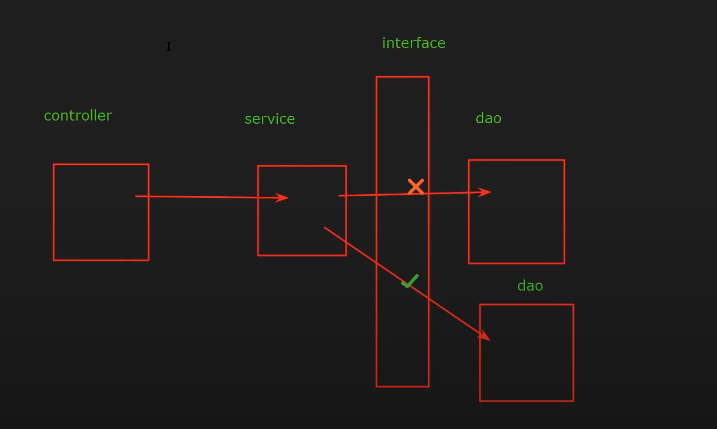

#### Descrição do Diagrama

1. **Controller**: O ponto de entrada para as requisições. Ele recebe a requisição do cliente e invoca o Service correspondente para processar a lógica de negócio.
2. **Service**: Contém a lógica de negócio da aplicação. Ele é responsável por coordenar as operações entre o Controller e o DAO.
3. **Interface DAO**: Define os métodos para acessar os dados, mas não contém a implementação concreta.
4. **DAO**: A implementação concreta da interface DAO, onde a lógica de acesso ao banco de dados é definida.

#### Fluxo de Comunicação

1. **Controller -> Service**:
    - O Controller recebe uma requisição e delega a responsabilidade para o Service.
    - O Controller não deve acessar o DAO diretamente para manter o desacoplamento e a separação de responsabilidades.

2. **Service -> Interface DAO**:
    - O Service chama a interface DAO, não a implementação concreta. Isso permite que diferentes implementações do DAO sejam injetadas, facilitando a troca de implementações e os testes.

3. **Interface DAO -> DAO**:
    - A interface DAO é implementada por uma classe concreta (DAO).
    - O Service se comunica com a interface DAO, e a implementação concreta do DAO realiza a operação de acesso aos dados.

### Diagrama Representativo

```plaintext
┌─────────────┐    chama    ┌──────────────┐    chama    ┌──────────────┐
│  Controller │ ──────────> │    Service   │ ──────────> │ Interface DAO│
└─────────────┘             └──────────────┘             └──────────────┘
                                                          ▲
                                                          │
                                                  Implementa
                                                          │
                                                  ┌─────────────┐
                                                  │     DAO     │
                                                  └─────────────┘
```

### Explicação:

1. **Controller**: Recebe a requisição e chama o **Service**.
2. **Service**: Processa a lógica de negócios e chama a **Interface DAO**.
3. **Interface DAO**: Define os métodos para acessar os dados.
4. **DAO**: Implementa a **Interface DAO** com a lógica de acesso aos dados.

Essa estrutura promove um design limpo, desacoplado e fácil de manter.

### Benefícios e Razões para essa Implementação

1. **Desacoplamento:**
    - **Separação da Lógica de Negócio e Acesso a Dados:** Ao usar uma interface `EmployeeDAO`, a lógica de negócios da aplicação não precisa saber como os dados são recuperados ou manipulados. Isso permite trocar a implementação do DAO sem afetar a lógica de negócios.
    - **Facilidade de Troca de Implementação:** Se você decidir mudar a forma de acessar os dados (por exemplo, de JDBC para Hibernate), você só precisa modificar a classe `EmployeeDAOImpl`, sem mudar o restante do código que usa o DAO.

2. **Facilidade de Testes:**
    - **Mocking e Testes Unitários:** A interface `EmployeeDAO` pode ser facilmente mockada em testes unitários, permitindo testar a lógica de negócios de forma isolada sem depender de um banco de dados real.
    - **Testes de Integração:** A implementação concreta pode ser testada separadamente, garantindo que as operações de acesso a dados funcionem corretamente.

3. **Manutenibilidade:**
    - **Organização do Código:** Manter a lógica de acesso a dados separada da lógica de negócios torna o código mais organizado e fácil de manter.
    - **Clareza e Responsabilidade Única:** Cada classe tem uma responsabilidade clara, seguindo o princípio da responsabilidade única (SRP).

4. **Extensibilidade:**
    - **Adição de Novas Funcionalidades:** Novos métodos podem ser adicionados à interface e implementados na classe concreta sem grandes mudanças na estrutura do projeto.
    - **Substituição de Implementação:** Diferentes implementações podem ser criadas para diferentes contextos, por exemplo, uma implementação para produção e outra para testes.

